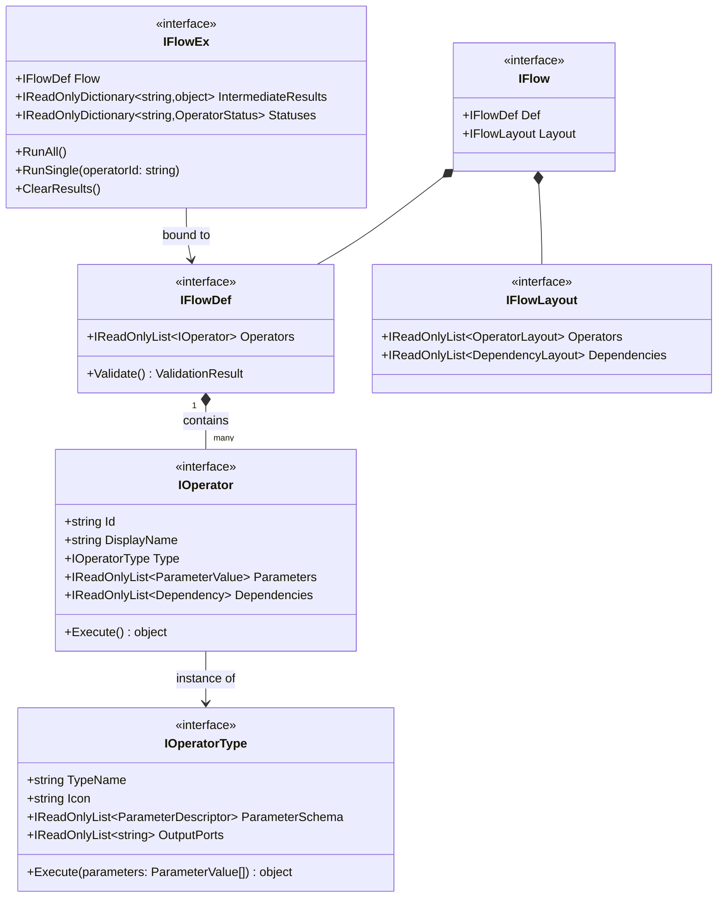
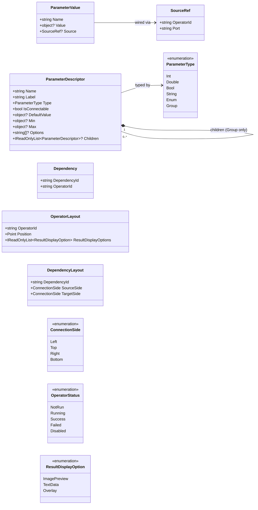

# IPLab – Interface Design

## Core Interfaces



## Supporting Types



## Responsibilities

| Interface | Responsibility |
|---|---|
| `IOperatorType` | The operator **template** — type name, icon, parameter schema (structure + constraints), output port names, and the OpenCV execution logic. Shared across all instances of the same type. |
| `IOperator` | A specific operator **instance** in a flow — ID, display name, reference to its `IOperatorType`, current parameter values (literal or wired), and direct dependencies. |
| `IFlowDef` | The serializable flow **definition** — the list of operator instances. Also owns flow-level validation (no circular dependencies, all connectable parameters wired to a declared dependency). Saved as JSON for headless use. |
| `IFlowLayout` | The **visual layout** — canvas positions per operator, and the connection side (Left/Top/Right/Bottom) for each end of a dependency line. Serialized alongside `IFlowDef` in the project file, but not needed for headless execution. |
| `IFlowEx` | Standalone runtime **executor**, constructed from an `IFlowDef`. Runs the full flow or a single operator. Owns all intermediate results (OpenCV `Mat`, contours, etc.) and per-operator status. Transient — created on demand, never serialized. |
| `IFlow` | The **open project document** — holds `IFlowDef` and `IFlowLayout`. This is what the desktop app keeps in memory. Not serialized itself; its two parts are serialized separately. |

## Operator Class vs. Instance

`IOperatorType` is the template. `IOperator` is the instance. The same type can appear multiple times in a flow with different IDs, names, and parameter values:

```
MedianBlurType
  ├── O21  "LeftEdgeBlur"   KernelSize=5
  └── O34  "RightEdgeBlur"  KernelSize=9
```

## Parameters: Values vs. Wired Sources

Each parameter in an operator instance carries either a literal `value` or a `source` reference — never both. A `source` points to a named output port on a predecessor operator.

`ParameterDescriptor.IsConnectable` declares whether a parameter can accept a wired source. Constraints (`Min`, `Max`, `Options`) live on the descriptor in `IOperatorType` — they are never serialized into the instance JSON.

## Dependencies vs. Port Connections

These operate at two different levels of granularity:

- **Port connection** — stored inside a `ParameterValue.Source`. Specifies exactly which output port of which operator feeds this parameter. Fine-grained, execution-level data-flow detail. Not visualized individually.
- **Dependency** — stored in `IOperator.Dependencies`. Expresses execution ordering only: *this operator cannot run until that upstream operator has finished*. **One entry per unique upstream operator** — it does not matter how many parameters are wired to that operator.

Dependency ID format: `D_{sourceOperatorId}_{targetOperatorId}` (e.g. `D_O2_O3`). This uniquely identifies the visual connection line between the two nodes and is the key used by `IFlowLayout.Dependencies` to store connector sides.

If an operator has two parameters both sourced from the same upstream operator, there is still only one `Dependency` (one visual line) but two `ParameterValue.Source` entries.

Visual connections and `Dependency` entries are always 1-to-1: one visual line = one `Dependency` = one `DependencyLayout`. Duplicate connections from the same source to the same target are not allowed; drawing one replaces the previous.

## Validation

`IFlowDef.Validate()` must verify:
1. All operator IDs are unique.
2. Every `ParameterValue.Source` references a declared `Dependency` on the same operator.
3. Every `ParameterValue.Source` port name exists in the referenced operator type's `OutputPorts`.
4. No circular dependencies exist in the dependency graph.
5. Connections types are concise, meaning bool connects to bool and so on.

## Serialization

| Artifact | Contains | Used for |
|---|---|---|
| Flow JSON | `IFlowDef` only | Headless production execution, version control, export |
| Project file | `IFlowDef` + `IFlowLayout` | Saving and restoring the full desktop session |

`IFlowEx` is always reconstructed at runtime — it is never serialized.

## Key Design Rules

- `IFlowDef` is the **serializable core** — simple, stable, versionable. No OpenCV types, no runtime state.
- `IFlowEx` owns all **heavy runtime data** (images, contours, keypoints). Results are keyed by operator ID string; `IFlowDef` enforces ID uniqueness.
- `IFlowLayout` has **no execution dependency** — `IFlowEx` never reads it.
- `IOperatorType.ParameterSchema` describes parameter **structure and constraints**. `IOperator.Parameters` holds the **current values** for this instance.
